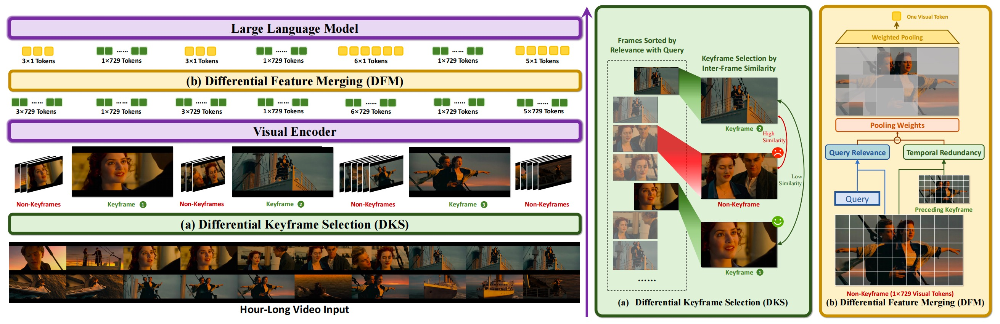

# ViLAMP
Official repository for paper "Scaling Video-Language Models to 10K Frames via Hierarchical Differential Distillation"



---
## :gear: Setup
```python
git clone https://github.com/steven-ccq/ViLAMP.git
cd ViLAMP
```

### Environment
```python
# python 3.8
pip install -r requirements.txt
```

### Install ViLAMP

---
## :dart: Inference

We provide evaluation scripts for five benchmarks: `Video-MME`, `MLVU`, `LongVideoBench`, `ActivityNetQA`, and `EgoSchema`. For more details, please refer to `scripts/eval/`.

Before running these scripts, please download the evaluation datasets and place them in the `dataset/` directory. Below are the instructions for the input arguments:
```bash
--dataset_path  Path to the test dataset
--video_dir    Path to the folder containing the videos required for testing
--output_dir   Path to the folder where the results will be saved
--version      Path to the model
--split        Split the dataset in the format i_N, where N is the total number of splits and i is the current split index (starting from 1). Default is 1_1.
--max_frame_num Maximum number of frames to sample per video. Default is 600.
```
Here is the example of evaluating Video-MME
```bash
python exp_vMME.py \
    --dataset_path dataset/Video-MME/videomme/test-00000-of-00001.parquet \
    --video_dir dataset/Video-MME/data \
    --output_dir dataset/Video-MME/output \
    --version models/ViLAMP-llava-qwen \
    --split 1_1 \
    --max_frame_num 600
```

## :rocket: Training

We offer training scripts designed for both single-node and multi-node environments. For more detailed instructions, please check the `scripts/train/` directory.

To streamline dataset organization, we utilize the `training_data.yaml` file to consolidate training data. Before initiating training, ensure that your dataset is registered in this file. We have included a straightforward example `example-10.json` to demonstrate the expected dataset format.

Note that if your training dataset requires specific processing methods, you will need to modify line 1225 of the `llava/train/train.py` file and insert your custom video processing function prior to this line to accommodate your dataset's needs.
